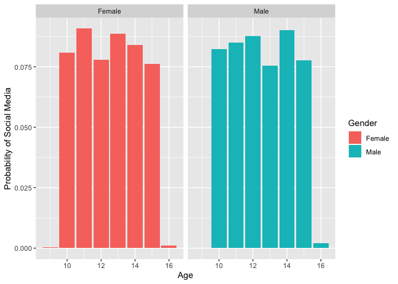

Test statistical assignment
================
Alexey Bessudnov
22 January 2020

Introduction
------------

Please change the author and date fields above as appropriate. Do not change the output format. Once you have completed the assignment you want to knit your document into a markdown document in the "github\_document" format and then commit both the .Rmd and .md files (and all the associated files with graphs) to your private assignment repository on Github.

Reading data (40 points)
------------------------

First, we need to read the data into R. For this assignment, I ask you to use data from the youth self-completion questionnaire (completed by children between 10 and 15 years old) from Wave 9 of the Understanding Society. It is one of the files you have downloaded as part of SN6614 from the UK Data Service. To help you find and understand this file you will need the following documents:

1.  The Understanding Society Waves 1-9 User Guide: <https://www.understandingsociety.ac.uk/sites/default/files/downloads/documentation/mainstage/user-guides/mainstage-user-guide.pdf>
2.  The youth self-completion questionnaire from Wave 9: <https://www.understandingsociety.ac.uk/sites/default/files/downloads/documentation/mainstage/questionnaire/wave-9/w9-gb-youth-self-completion-questionnaire.pdf>
3.  The codebook for the file: <https://www.understandingsociety.ac.uk/documentation/mainstage/dataset-documentation/datafile/youth/wave/9>

``` r
library(tidyverse)
```

    ## ── Attaching packages ─────────────────────────────────────── tidyverse 1.3.0 ──

    ## ✓ ggplot2 3.2.1     ✓ purrr   0.3.3
    ## ✓ tibble  2.1.3     ✓ dplyr   0.8.3
    ## ✓ tidyr   1.0.0     ✓ stringr 1.4.0
    ## ✓ readr   1.3.1     ✓ forcats 0.4.0

    ## ── Conflicts ────────────────────────────────────────── tidyverse_conflicts() ──
    ## x dplyr::filter() masks stats::filter()
    ## x dplyr::lag()    masks stats::lag()

``` r
# This attaches the tidyverse package. If you get an error here you need to install the package first. 
d <- read_tsv("/Users/jsn2817/Downloads/UKDA-6614-tab/tab/ukhls_w9/i_youth.tab")
```

    ## Parsed with column specification:
    ## cols(
    ##   .default = col_double()
    ## )

    ## See spec(...) for full column specifications.

``` r
# You need to add between the quotation marks a full path to the required file on your computer.
```

Tabulate variables (10 points)
------------------------------

In the survey children were asked the following question: "Do you have a social media profile or account on any sites or apps?". In this assignment we want to explore how the probability of having an account on social media depends on children's age and gender.

Tabulate three variables: children's gender, age (please use derived variables) and having an account on social media.

``` r
# add your code here
Tab1 <- d[,c("i_sex","i_age_dv","i_ypsocweb")]
```

Recode variables (10 points)
----------------------------

We want to create a new binary variable for having an account on social media so that 1 means "yes", 0 means "no", and all missing values are coded as NA. We also want to recode gender into a new variable with the values "male" and "female" (this can be a character vector or a factor).

``` r
# add your code here
table(d$i_ypsocweb)
```

    ## 
    ##   -9    1    2 
    ##   14 2277  530

``` r
table(d$i_sex)
```

    ## 
    ##    1    2 
    ## 1411 1410

``` r
d$i_ypsocweb.r <- NA
d$i_ypsocweb.r[d$i_ypsocweb == 1] <- 1
d$i_ypsocweb.r[d$i_ypsocweb == 2] <- 0
d$i_ypsocweb.r[d$i_ypsocweb == -9] <- NA

table(d$i_ypsocweb.r)
```

    ## 
    ##    0    1 
    ##  530 2277

``` r
d$gender <- NA
d$gender[d$i_sex == 1] <- "Male"
d$gender[d$i_sex == 2] <- "Female"
d$gender[d$i_sex == -9] <- NA

table(d$gender)
```

    ## 
    ## Female   Male 
    ##   1410   1411

Calculate means (10 points)
---------------------------

Produce code that calculates probabilities of having an account on social media (i.e. the mean of your new binary variable produced in the previous problem) by age and gender.

``` r
# add your code here
d.m <- d[d$i_sex == 1,]
d.f <- d[d$i_sex == 2,]

prop.table(table(d$i_age_dv, d$i_ypsocweb.r))
```

    ##     
    ##                 0            1
    ##   9  0.0003562522 0.0000000000
    ##   10 0.0837192732 0.0794442465
    ##   11 0.0530815818 0.1232632704
    ##   12 0.0220876380 0.1421446384
    ##   13 0.0138938368 0.1499821874
    ##   14 0.0092625579 0.1649447809
    ##   15 0.0064125401 0.1482009263
    ##   16 0.0000000000 0.0032062700

``` r
prop.table(table(d$gender, d$i_ypsocweb.r))
```

    ##         
    ##                  0         1
    ##   Female 0.0798005 0.4203776
    ##   Male   0.1090132 0.3908087

``` r
prop.table(table(d.m$i_age_dv, d.m$i_ypsocweb.r))
```

    ##     
    ##               0          1
    ##   10 0.09194583 0.07270135
    ##   11 0.06272274 0.10762651
    ##   12 0.02494654 0.14825374
    ##   13 0.01639344 0.13542409
    ##   14 0.01140413 0.16821098
    ##   15 0.01069138 0.14540271
    ##   16 0.00000000 0.00427655

``` r
prop.table(table(d.f$i_age_dv, d.f$i_ypsocweb.r))
```

    ##     
    ##                 0            1
    ##   9  0.0007122507 0.0000000000
    ##   10 0.0754985755 0.0861823362
    ##   11 0.0434472934 0.1388888889
    ##   12 0.0192307692 0.1360398860
    ##   13 0.0113960114 0.1645299145
    ##   14 0.0071225071 0.1616809117
    ##   15 0.0021367521 0.1509971510
    ##   16 0.0000000000 0.0021367521

Write short interpretation (10 points)
--------------------------------------

Write two or three sentences interpreting your findings above.

In general males are slightly less likely than females to have a social media account. Additionally, for both genders as they got older they were less likely not to have a social media account than before.

Visualise results (20 points)
-----------------------------

Create a statistical graph (only one, but it can be faceted) illustrating your results (i.e. showing how the probability of having an account on social media changes with age and gender). Which type of statistical graph would be most appropriate for this?

``` r
# add your code here
library(ggplot2)
ggplot(d, aes(x = i_age_dv, y = i_ypsocweb.r, fill = as.factor(gender))) +
  geom_bar(aes(y = (..count..)/sum(..count..))) + 
  labs(x = "Age", y  = "Probability of Social Media", fill = "Gender") +
  facet_wrap(~ gender)
```



Conclusion
----------

This is a test formative assignment and the mark will not count towards your final mark. If you cannot answer any of the questions above this is fine -- we are just starting this module! However, please do submit this assignment in any case to make sure that you understand the procedure, that it works correctly and you do not have any problems with summative assignments later.
